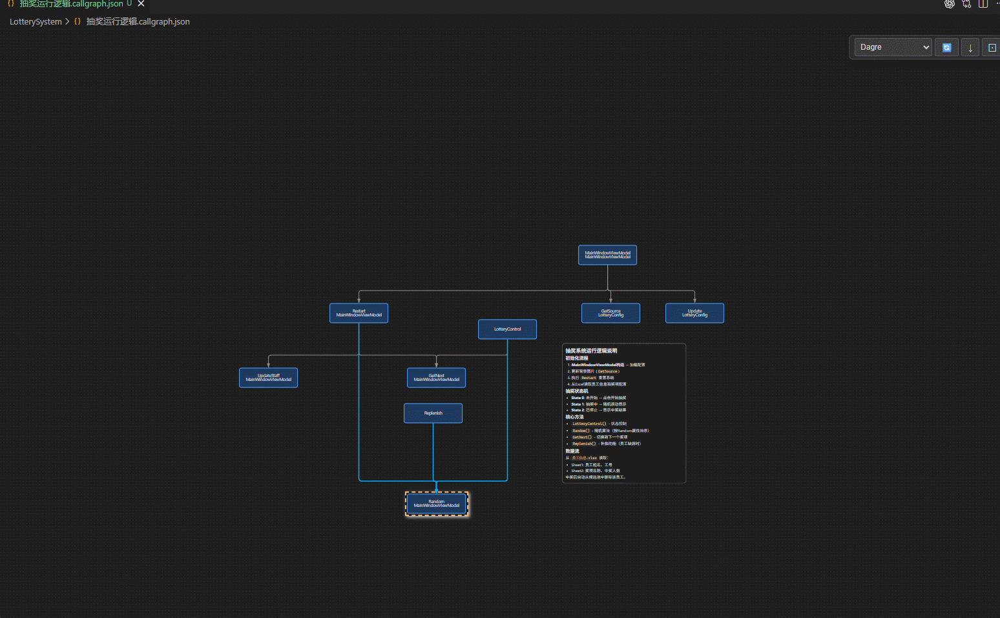
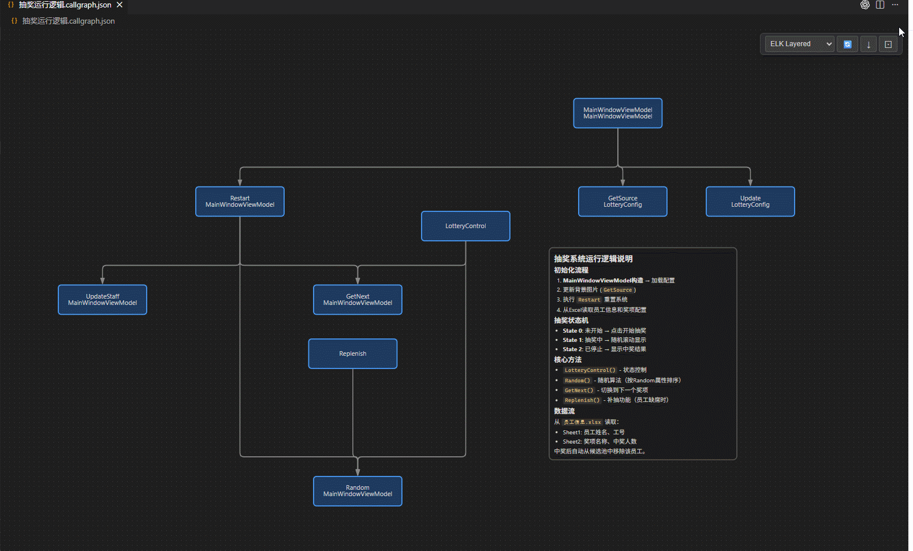
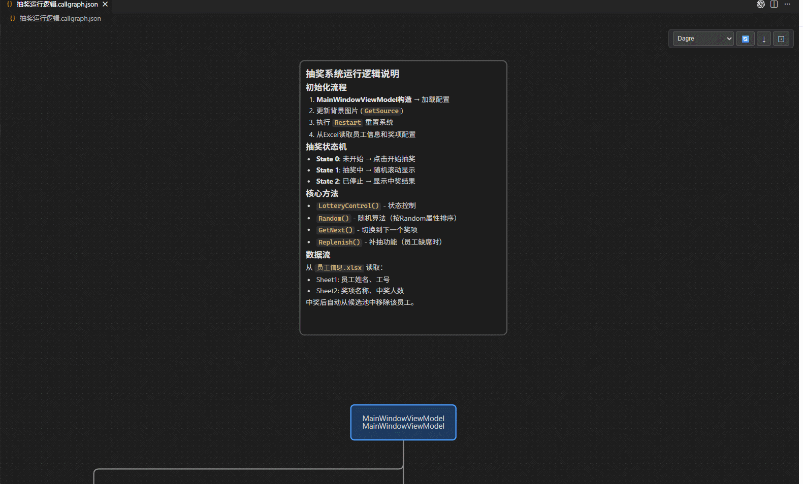

# Code Call Graph Editor

**Visualize Code Call Relationships in VS Code** — Function/Method call graph visualization with graphical editing, code navigation, and multiple layout algorithms.

English | [简体中文](README.zh-cn.md)



---

## Installation

**From VS Code Marketplace**

1. Open VS Code
2. Open Extensions panel (`Ctrl+Shift+X`)
3. Search for `Code Call Graph Editor`
4. Click **Install**


---

## Quick Start

1. In code editor, place cursor on a function/method definition
2. Right-click and select **Create Call Graph**, or press `Ctrl+Shift+G`
3. Auto-generate `.callgraph.json` file and open the graphical editor
4. Double-click nodes to jump to corresponding source code

---

## Core Features

### One-Click Call Graph Generation

Place cursor on any function/method and press `Ctrl+Shift+G` to automatically analyze call chains and generate a call graph. Based on LSP Call Hierarchy protocol, supports all languages that provide this capability.


---

### Graphical Editor

Canvas editor based on [AntV X6](https://x6.antv.antgroup.com/) with rich interactive operations:

- **Double-click canvas** — Create Code node
- **Right-click canvas** — Create Code or Note node
- **Drag nodes** — Move freely
- **Box selection/Multi-select** — Batch operations
- **Toolbar connect button** — Enter connection mode, click target node to create edge
- **Copy/Paste** — `Ctrl+C` / `Ctrl+V`
- **Undo/Redo** — `Ctrl+Z` / `Ctrl+Y`


---

### Code Navigation & Method Binding

**Code Navigation:** Double-click Code nodes to automatically open corresponding source files and highlight method definitions.

**Method Library:** Press `Ctrl+Shift+M` in code to add method at cursor to library. In canvas, click node toolbar's bind button to select and bind methods from library.


---

### Multiple Layout Algorithms

Built-in 4 graph layout algorithms, switch via top-right dropdown:

| Algorithm | Features |
|-----------|----------|
| **Dagre** | Classic hierarchical layout, suitable for most call graphs (default) |
| **ELK Layered** | Advanced hierarchical layout with better edge crossing minimization |
| **ELK Tree** | Tree layout, ideal for pure tree-like call relationships |
| **Custom (BFS)** | Custom breadth-first layout |

Supports **Top-to-Bottom (TB)** and **Left-to-Right (LR)** directions. Edge routes auto-refresh when switching directions.

Supports **Global Layout** (when no nodes selected) and **Partial Layout** (layout only selected nodes).


---

### Alignment & Distribution

When 2+ nodes are selected, alignment toolbar auto-appears at canvas bottom:

- **Align:** Left, Horizontal Center, Right, Top, Vertical Center, Bottom
- **Distribute:** Horizontal/Vertical even spacing (requires 3+ nodes)
- **Auto Layout (Selected):** Apply layout to selected nodes only

**Snap guides** assist manual alignment when dragging nodes.


---

### Tag System

Add colored tags to Code nodes for categorization:

- **Predefined Tags:** Loop, Condition, Async, Entry, Critical, Todo (colors configurable)
- **Custom Tags:** Right-click node → Tags → New Tag
- **Toggle Tags:** Check/uncheck in right-click node → Tags menu

Tags display at node bottom as colored pills.


---

### Note Nodes & Markdown

Note nodes support full Markdown rendering, perfect for adding annotations to call graphs:

- Headers, lists, bold/italic, code blocks, tables
- **Interactive Checkboxes:** Use `- [ ]` / `- [x]` syntax, click to toggle
- **Resizable:** Drag bottom-right handle when selected
- **Edit Mode:** Double-click to enter raw Markdown editing




---

### Edge Highlighting & Selection

- When **node is selected**, all connected edges auto-highlight in blue
- When **edge is directly selected**, displays with thicker style and higher z-index
- Multi-layer zIndex management for clear distinction of overlapping edges

---

### AI / Copilot Integration

This project includes [.github/copilot-instructions.md](.github/copilot-instructions.md) defining AI instructions for call graph data format.

**Method 1: Copilot Auto-Recognition**

If your project has `.github/copilot-instructions.md`, VS Code Copilot will auto-read it. Just chat directly:

> *"Analyze the Calculator class call relationships in src/services/calculator.ts and generate callgraph.json"*

**Method 2: Copy Prompt Template**

For other AI tools, copy this prompt template and replace `{file path or code}`:

```
Please analyze the function call relationships in the following code and generate XX.callgraph.json.

Requirements:
- Output JSON format with nodes and edges arrays
- Each node contains: id, label, type("code"), symbol(name, uri, containerName, line, signature)
- Each edge contains: from(caller id), to(callee id)
- Label format: For class methods, use "methodName\nClassName" (\n for newline)
- Line numbers start from 0
- URI uses workspace-relative paths
- Signature format:
  * Typed languages (TypeScript/Java/C#/Go/Rust): parameter types only, e.g., "(number, string)"
  * Untyped languages (Python/Ruby/Lua/JavaScript): parameter names, e.g., "(name, level)"

Code:
{file path or code}
```

AI will output `.callgraph.json` content in the correct format. Save as `xxx.callgraph.json` to open in editor.

**Note Node Quick Prompt**

Use this when you want to summarize content and add a note node to an existing file:

```
Summarize {content} and add a note node to {file}.

Requirements:
- Keep all existing nodes and edges unchanged
- Append one node: id "note-1", label "Note", type "note"
- content: short Markdown summary of {content}
- edges: leave as-is (do not add new edges)
```

---

## Keyboard Shortcuts

### Global Shortcuts

| Shortcut | Function |
|----------|----------|
| `Ctrl+Shift+G` | Generate call graph from method at cursor |
| `Ctrl+Shift+M` | Add method at cursor to method library |

### Canvas Shortcuts

| Shortcut | Function |
|----------|----------|
| `Delete` / `Backspace` | Delete selected nodes or edges |
| `Ctrl+Z` | Undo |
| `Ctrl+Y` / `Ctrl+Shift+Z` | Redo |
| `Ctrl+C` | Copy selected nodes |
| `Ctrl+V` | Paste nodes |
| `F2` | Edit selected node/edge text |
| `Space` | Select all text and edit |
| `Esc` | Cancel connection mode / Cancel edit |
| Type characters | Clear text and type (when single node/edge selected) |

---

## Configuration

Search `callGraph` in VS Code Settings to configure:

| Setting | Type | Default | Description |
|---------|------|---------|-------------|
| `callGraph.predefinedTags` | array | 6 predefined tags | Predefined tag list (name + color) |
| `callGraph.codeNodeColor` | object | `{fill: "#1e3a5f", stroke: "#4a9eff"}` | Code node colors |
| `callGraph.noteNodeColor` | object | `{fill: "#1A1A1A", stroke: "#555555"}` | Note node colors |
| `callGraph.unboundCodeNodeColor` | object | `{fill: "#3d2020", stroke: "#d48a8a"}` | Unbound code node colors |
| `callGraph.showFileNameTag` | boolean | `false` | Auto-show filename tags |
| `callGraph.fileNameTagColor` | string | `"#607D8B"` | Filename tag color |
| `callGraph.removeMethodAfterBind` | boolean | `false` | Remove method from library after binding |

---

## File Format

Call graphs are stored as `.callgraph.json` files, essentially standard JSON:

```json
{
  "title": "Calculator Call Graph",
  "nodes": [
    {
      "id": "node-1",
      "label": "add\nCalculator",
      "type": "code",
      "symbol": {
        "name": "add",
        "uri": "src/calculator.ts",
        "containerName": "Calculator",
        "line": 22,
        "signature": "(number, number)"
      },
      "tags": ["Entry"]
    },
    {
      "id": "note-1",
      "label": "Note",
      "type": "note",
      "content": "# Note\nThis is a description"
    }
  ],
  "edges": [
    {
      "from": "node-1",
      "to": "node-2",
      "type": "call"
    }
  ]
}
```

**Node Types:**
- `code` — Code node, bound to function/method in source file
- `note` — Note node, supports Markdown content

**Edge Types:**
- `call` — Call relationship (gray arrow)
- `explain` — Explanation relationship (gold arrow)

---

## Supported Languages

This extension is based on VS Code LSP's **Call Hierarchy** capability, theoretically supporting all languages that provide it:

- TypeScript / JavaScript
- C# (.NET)
- Java
- Python
- Go
- C / C++
- Rust
- And other language service extensions supporting Call Hierarchy

> Manual node creation and AI-generated call graphs don't rely on LSP, supporting any language.

---

## Internationalization

- 简体中文 (Simplified Chinese)
- English

The extension automatically switches based on VS Code's language settings.

---

## Donate

If this project helps you, feel free to buy me a coffee :)

**Alipay Donation:**


Thank you for your support!

---

## License

[MIT](LICENSE)
